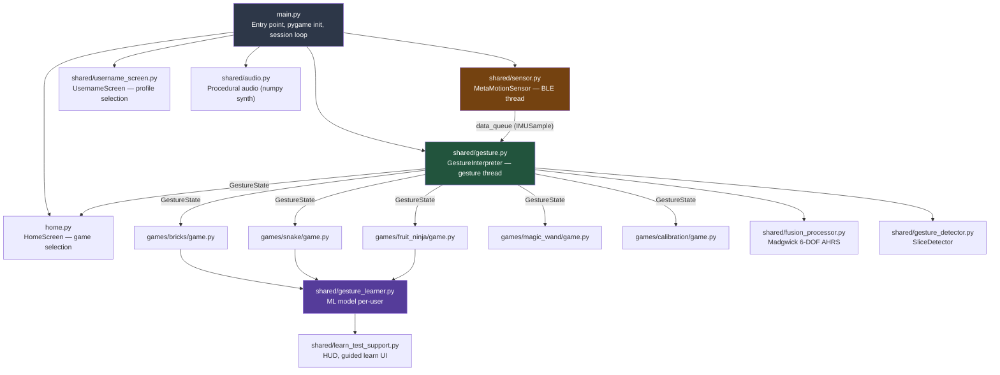

# Arcade for All — Codebase Analysis

> **~9,200 lines of Python** | 5 games + home screen | BLE sensor + gesture ML pipeline

## Architecture Summary

### Threading Model
| Thread | Owner | Purpose |
|--------|-------|---------|
| Main thread | `main.py` / pygame | Event loop, rendering, game logic |
| BLE thread | `sensor.py` | asyncio event loop for bleak BLE I/O |
| Gesture thread | `gesture.py` | Drains sensor queue, runs filters |
| Validation thread | `gesture_learner.py` | Background CV computation |

---

## Key Source Files

| File | Lines | Purpose |
|------|-------|---------|
| [main.py](file:///Users/jerold/dev/Bricks/main.py) | 338 | Entry point, arg parsing, session loop |
| [home.py](file:///Users/jerold/dev/Bricks/home.py) | 696 | Scrollable game card selection screen |
| [sensor.py](file:///Users/jerold/dev/Bricks/shared/sensor.py) | 914 | BLE MetaMotion sensor, raw protocol |
| [gesture.py](file:///Users/jerold/dev/Bricks/shared/gesture.py) | 661 | GestureInterpreter, GestureState, KeyboardFallback |
| [fusion_processor.py](file:///Users/jerold/dev/Bricks/shared/fusion_processor.py) | 278 | Madgwick AHRS filter |
| [gesture_detector.py](file:///Users/jerold/dev/Bricks/shared/gesture_detector.py) | 177 | Slice gesture detection |
| [gesture_learner.py](file:///Users/jerold/dev/Bricks/shared/gesture_learner.py) | 983 | Per-user ML model (Random Forest) |
| [learn_test_support.py](file:///Users/jerold/dev/Bricks/shared/learn_test_support.py) | 425 | Shared learn/test HUD + guided flow |
| [audio.py](file:///Users/jerold/dev/Bricks/shared/audio.py) | 292 | Procedural synth (square/triangle wave) |
| [username_screen.py](file:///Users/jerold/dev/Bricks/shared/username_screen.py) | 279 | Profile selection/creation |
| [bricks/game.py](file:///Users/jerold/dev/Bricks/games/bricks/game.py) | 876 | Breakout clone |
| [snake/game.py](file:///Users/jerold/dev/Bricks/games/snake/game.py) | 730 | Grid snake |
| [fruit_ninja/game.py](file:///Users/jerold/dev/Bricks/games/fruit_ninja/game.py) | ~1,300 | Fruit Slice (largest game) |
| [calibration/game.py](file:///Users/jerold/dev/Bricks/games/calibration/game.py) | ~1,000 | 4-panel IMU visualizer |
| [magic_wand/game.py](file:///Users/jerold/dev/Bricks/games/magic_wand/game.py) | 290 | Gesture tutorial game |

---

## Identified Flaws & Areas for Improvement

### 🔴 Critical / High-Impact

#### 1. Massive GestureState Copying — O(n) Field-by-Field Copy Every Call
[gesture.py:333-372](file:///Users/jerold/dev/Bricks/shared/gesture.py#L333-L372)

`get_state()` manually copies **35+ fields** one-by-one into a new `GestureState`. This is fragile (add a field to the dataclass, forget to copy it here → silent bug) and already happened — any new field requires updates in two places.

> [!WARNING]
> **Fix**: Use `dataclasses.replace(self.state)` or `copy.copy(self.state)` under the lock. Or, since `GestureState` is a frozen snapshot, make it `@dataclass(frozen=True)` and assign atomically.

#### 2. Game Launch Code is Copy-Pasted in main.py
[main.py:292-321](file:///Users/jerold/dev/Bricks/main.py#L292-L321)

Each game branch repeats: `game = XGame(cur, clock, debug=debug, mode=mode, audio=audio, username=username)` → `game.run(gesture_src)` → `debug = game._debug`. Five identical blocks that differ only in the class name.

> [!TIP]
> **Fix**: Create a `GAME_REGISTRY` dict mapping name → class, then `game = GAME_REGISTRY[selected](...)`.

#### 3. No Base Game Class — Massive Code Duplication Across Games
Each game file (bricks: 876, snake: 730, fruit_ninja: 1300, calibration: 1000) independently re-implements:
- `_init_layout()` with identical scale/font logic
- `_toggle_fullscreen()` 
- Learn/test submode switching (`_switch_submode`, `_init_learner`)
- Debug overlay rendering
- Pause/resume screen
- Keyboard event handling boilerplate

> [!IMPORTANT]
> **Fix**: Extract a `BaseGame` class with common layout, fullscreen toggling, learn/test infrastructure, debug HUD, and a `_tick(dt, gs)` method games override.

#### 4. `_emit_sample()` Called Twice per IMU Frame in Raw Mode
[sensor.py:796-806](file:///Users/jerold/dev/Bricks/shared/sensor.py#L792-L806)

`_parse_acc` calls `_emit_sample()`, then `_parse_gyro` also calls `_emit_sample()`. In raw mode, acc and gyro arrive as separate notifications, so the queue gets **two samples per physical frame** — one with stale gyro, one with stale acc. This doubles the effective processing rate and introduces a one-notification-lag cross-contamination.

> [!CAUTION]
> **Fix**: Only emit when both acc and gyro have been updated since the last emission (use a dirty-flag pair).

#### 5. `sys.exit(0)` Called from Multiple Locations
[home.py:206-207](file:///Users/jerold/dev/Bricks/home.py#L206-L207), [home.py:245-246](file:///Users/jerold/dev/Bricks/home.py#L245-L246), [magic_wand/game.py:124](file:///Users/jerold/dev/Bricks/games/magic_wand/game.py#L123-L124)

`pygame.quit(); sys.exit(0)` bypasses the `finally` block in `main.py`, which means `gesture_src.stop()` and `sensor.stop_background()` never run. BLE connection is leaked, sensor LED stays on.

> [!CAUTION]
> **Fix**: Return a sentinel like `"quit"` from `run()` and let `main.py` handle shutdown.

---

### 🟡 Medium-Impact

#### 6. Excessive Console Logging in Production
`sensor.py` prints every 50th sample, every SF notification, first 20 notifications, etc. `gesture.py` prints every 10th sample. In a 10-minute play session, that's ~6,000+ print calls.

**Fix**: Gate behind `logger.debug()` instead of `print()`, so `--verbose` controls visibility.

#### 7. Magic Numbers Scattered Throughout
- `45.0` (gyro threshold for baseline adaptation) in [gesture.py:436](file:///Users/jerold/dev/Bricks/shared/gesture.py#L436)
- `0.002` (adapt rate) in [gesture.py:439](file:///Users/jerold/dev/Bricks/shared/gesture.py#L439)
- `2.5 * 100` (functional cal duration) in [gesture.py:454](file:///Users/jerold/dev/Bricks/shared/gesture.py#L454)
- `200.0` in spin scaling: [gesture.py:546](file:///Users/jerold/dev/Bricks/shared/gesture.py#L546)

**Fix**: Move to `GestureConfig` fields.

#### 8. `PowerUp.draw()` Creates a New Font Every Frame
[bricks/game.py:162](file:///Users/jerold/dev/Bricks/games/bricks/game.py#L161-L163)

`pygame.font.SysFont("monospace", font_size, bold=True)` is called inside `draw()` which runs 60 times/sec. Font creation is expensive.

**Fix**: Cache the font at init time or use the game's existing font instances.

#### 9. No Error Recovery for BLE Disconnection Mid-Game
If the sensor disconnects during gameplay (battery dies, range exceeded), the gesture queue simply stops producing samples. The `_loop` in `gesture.py` keeps trying `queue.get(timeout=0.05)` and decays velocity, but there's no user feedback, no reconnection attempt, and no fallback to keyboard.

**Fix**: Detect prolonged empty queue → show "sensor disconnected" overlay → offer keyboard fallback.

#### 10. `_update_hover()` Sets `_selected_idx` as Side Effect
[home.py:262](file:///Users/jerold/dev/Bricks/home.py#L253-L263)

Mouse hover silently changes the keyboard/gesture selection index. This means if you're navigating with tilt and accidentally move the mouse, the selection jumps unexpectedly.

**Fix**: Separate mouse highlight from the authoritative `_selected_idx`.

#### 11. No High-Score Persistence
Games track score in memory but never save it. The gesture learner system already has per-user data storage (`data/gestures/{username}/`), so the infrastructure for persistence exists.

**Fix**: Add a simple JSON scores file per user.

#### 12. `rc_car_bridge.py` and `rc_simulator.py` Are Orphaned
These files hard-code `username="my_kid"` and aren't integrated into the main application or documented in the game registry. They also don't handle BLE connection failure.

**Fix**: Either integrate into main.py as a "--rc-bridge" mode or move to an `examples/` directory.

---

### 🟢 Low-Impact / Polish

#### 13. Hardcoded 800×600 Base Resolution
Every file defines `W, H = 800, 600` independently. While scaling logic exists, the base resolution assumption is scattered across ~10 files.

**Fix**: Single constant import from `shared/constants.py`.

#### 14. `_is_fullscreen` Detection is Brittle
[home.py:135](file:///Users/jerold/dev/Bricks/home.py#L135): `self._is_fullscreen = not (sw == 800 and sh == 600)` — any non-800×600 window is treated as fullscreen.

**Fix**: Track fullscreen state explicitly via a flag set in `_toggle_fullscreen()`.

#### 15. No Type Checking on Game Return Values
Games return `"home"` as a string sentinel. No validation that the string is valid. A typo like `"hom"` would be silently ignored and loop forever.

**Fix**: Use an `enum` for game return states.

#### 16. `_cal_buf` Grows Without Bound During Calibration
[gesture.py:410](file:///Users/jerold/dev/Bricks/shared/gesture.py#L410) — Only cleared when calibration completes. If calibration fails (noisy environment), the buffer grows indefinitely.

**Fix**: Cap at `2 * calibration_samples` and use a rolling window.

#### 17. Missing `__init__.py` in Root
The project has `__init__.py` in `games/` and `shared/` but not at root level. Imports from `shared.sensor` etc. work only because `main.py` runs from the project root.

#### 18. Test Coverage is Narrow
Only `test_gesture_learner.py` exists (359 lines). No tests for:
- `sensor.py` (BLE notification parsing)
- `gesture.py` (calibration, tilt mapping, flick detection)
- `fusion_processor.py` (Madgwick filter correctness)
- Any game logic
- `home.py` navigation

#### 19. `audio.py` — Potential Numpy Overflow
[audio.py:155](file:///Users/jerold/dev/Bricks/shared/audio.py#L155): `(wave * env * 32767).clip(-32767, 32767).astype(np.int16)` — intermediate `wave * env * 32767` is float64 but if env is float32 and wave is float64, the product types vary. This works but is fragile.

#### 20. Unused Imports & Dead Code
- `from typing import List` in files using Python 3.9+ (can use `list` directly)
- `field` imported but unused in several dataclasses
- `_DE = 0.375` (dotted eighth) defined in `audio.py` but never used

---

## Summary Scorecard

| Category | Score | Notes |
|----------|-------|-------|
| **Architecture** | ⭐⭐⭐ | Clean separation of concerns but severe code duplication across games |
| **Signal Processing** | ⭐⭐⭐⭐ | Solid Madgwick filter, smart gravity extraction, good calibration |
| **BLE Integration** | ⭐⭐⭐⭐ | Impressive raw GATT protocol work, sensor fusion fallback paths |
| **ML Pipeline** | ⭐⭐⭐⭐ | Well-designed learn/test/validate cycle with quality guards |
| **Accessibility** | ⭐⭐⭐⭐⭐ | Thoughtful dual-mode system (ASTRA/VEERA), adaptive baseline |
| **Code Quality** | ⭐⭐½ | Excessive duplication, magic numbers, chatty logging, no base class |
| **Testing** | ⭐⭐ | Only 1 test file; core modules untested |
| **Error Handling** | ⭐⭐ | BLE disconnect unhandled, `sys.exit()` bypasses cleanup |
| **Documentation** | ⭐⭐⭐⭐⭐ | Excellent README, inline docstrings, prompt docs |

