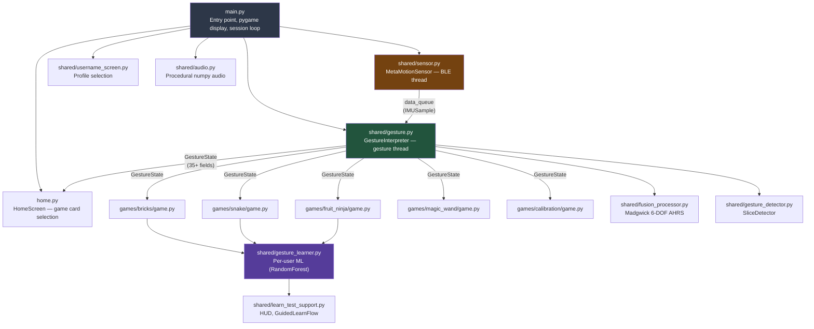

# Arcade for All — Release 0.1 Review & Implementation Plan

> **Consolidated technical analysis, sensor diagnostics, and improvement roadmap.**
> Generated: 2026-08-01 | Covers: ~9,200 lines across 15 Python source files

---

## Table of Contents

1. [Project Overview](#1-project-overview)
2. [Architecture & Data Flow](#2-architecture--data-flow)
3. [Source File Inventory](#3-source-file-inventory)
4. [MetaMotion Sensor Implementation Review](#4-metamotion-sensor-implementation-review)
5. [Calibration & Orientation Review](#5-calibration--orientation-review)
6. [Gesture Detection Pipeline Review](#6-gesture-detection-pipeline-review)
7. [Codebase Quality Findings](#7-codebase-quality-findings)
8. [Summary Scorecard](#8-summary-scorecard)
9. [Consolidated Implementation Plan](#9-consolidated-implementation-plan)
10. [Changes Already Applied (Pre-Release)](#10-changes-already-applied-pre-release)

---

## 1. Project Overview

Wrist-gesture controlled pygame games powered by the MbientLab MetaMotion BLE inertial sensor. Players tilt, flick, and twist their wrist to control paddles, slice fruit, and steer snakes — no buttons required.

**Games**: Bricks (breakout), Snake, Fruit Ninja (slice), Calibration (IMU visualizer), Magic Wand (gesture tutorial)

**Modes**: ASTRA (accessible — wider paddle, lower thresholds, adaptive), VEERA (standard), Keyboard (no hardware)

---

## 2. Architecture & Data Flow



### Threading Model

| Thread | Owner | Purpose |
|--------|-------|---------|
| Main/pygame | `main.py` | Event loop, rendering, game logic (60 FPS) |
| BLE thread (`ble-sensor`) | `sensor.py` | asyncio event loop for bleak BLE I/O |
| Gesture thread (`gesture-interp`) | `gesture.py` | Drains sensor queue, runs Madgwick + gesture extraction |
| Validation thread | `gesture_learner.py` | Background k-fold cross-validation |

---

## 3. Source File Inventory

| File | Lines | Purpose |
|------|-------|---------|
| [main.py](file:///Users/jerold/dev/Bricks/main.py) | 338 | Entry point, arg parsing, session loop |
| [home.py](file:///Users/jerold/dev/Bricks/home.py) | 696 | Scrollable game card selection |
| [sensor.py](file:///Users/jerold/dev/Bricks/shared/sensor.py) | 914 | BLE MetaMotion, raw GATT protocol |
| [gesture.py](file:///Users/jerold/dev/Bricks/shared/gesture.py) | 661 | GestureInterpreter, GestureState, KeyboardFallback |
| [fusion_processor.py](file:///Users/jerold/dev/Bricks/shared/fusion_processor.py) | 278 | Madgwick AHRS (software sensor fusion fallback) |
| [gesture_detector.py](file:///Users/jerold/dev/Bricks/shared/gesture_detector.py) | 177 | SliceDetector (angular velocity threshold) |
| [gesture_learner.py](file:///Users/jerold/dev/Bricks/shared/gesture_learner.py) | 983 | Per-user ML model, learn/test/validate cycle |
| [learn_test_support.py](file:///Users/jerold/dev/Bricks/shared/learn_test_support.py) | 425 | Shared HUD rendering, GuidedLearnFlow |
| [audio.py](file:///Users/jerold/dev/Bricks/shared/audio.py) | 292 | Procedural synth (square/triangle wave, no files) |
| [username_screen.py](file:///Users/jerold/dev/Bricks/shared/username_screen.py) | 279 | Profile selection/creation at startup |
| [bricks/game.py](file:///Users/jerold/dev/Bricks/games/bricks/game.py) | 876 | Breakout clone |
| [snake/game.py](file:///Users/jerold/dev/Bricks/games/snake/game.py) | 730 | Grid snake |
| [fruit_ninja/game.py](file:///Users/jerold/dev/Bricks/games/fruit_ninja/game.py) | ~1,300 | Fruit Slice (gyro cursor, combo system) |
| [calibration/game.py](file:///Users/jerold/dev/Bricks/games/calibration/game.py) | ~920 | 4-panel aviation-style IMU visualizer |
| [magic_wand/game.py](file:///Users/jerold/dev/Bricks/games/magic_wand/game.py) | 290 | Gesture tutorial (orb collection) |

---

## 4. MetaMotion Sensor Implementation Review

### 4.1 — Not Using the Official SDK

The project communicates with the MetaMotion sensor entirely via raw BLE GATT writes using the `bleak` library. It does **not** use MbientLab's official `metawear` Python SDK (which wraps `libmetawear`, a C library).

**What this means in practice:**
- Every register address and byte-packing format is hardcoded (`_CMD_SF_MODE = bytes([0x19, 0x02, 0x02, 0x31])`)
- The code must handle BMI160/BMI270 differences manually
- No automatic reconnection on BLE drop
- No native calibration persistence framework
- Scale factors (`_ACC_SCALE = 4.0 / 32768.0`) are manually computed and must match the configured range

**What works well despite this:**
- The BLE protocol implementation is thorough and well-documented with register map comments
- Sensor Fusion module probing with graceful fallback to raw acc/gyro
- Corrected accelerometer/gyroscope streams (module 0x04, 0x05) used when SF is available
- LED, haptic, and connection parameter tuning all functional

### 4.2 — NDOF Mode Was Causing Magnetic Interference (FIXED)

The original configuration used **NDOF (Nine Degrees of Freedom)** mode which fuses accelerometer + gyroscope + **BMM150 magnetometer**. Indoors, magnetic interference from electronics and metal structures corrupts the magnetometer readings. Because the Bosch sensor fusion engine trusts the magnetometer for absolute heading, this corruption propagates into **pitch and roll**, causing the orientation to jump and drift violently.

**Root cause chain:**
1. `_CMD_SF_MODE` was `0x01` (NDOF) → magnetometer active
2. Indoor environment distorts magnetic field
3. Bosch Kalman Filter trusts corrupted mag data
4. Roll/pitch/heading all become unstable
5. Paddle control and calibration game become unusable

**Fix applied:** Changed to **IMUPlus** mode (`0x02`) — see [Section 10](#10-changes-already-applied-pre-release).

### 4.3 — Double Sample Emission in Raw Fallback Mode

When sensor fusion is unavailable, `sensor.py` falls back to raw acc/gyro (modules 0x03/0x13). Because acc and gyro arrive as separate BLE notifications, both `_parse_acc()` and `_parse_gyro()` independently call `_emit_sample()`:

```python
# sensor.py lines 792-806
def _parse_acc(self, payload):
    ...
    self._last_acc = (x * _ACC_SCALE, y * _ACC_SCALE, z * _ACC_SCALE)
    self._emit_sample()  # ← emits with stale gyro

def _parse_gyro(self, payload):
    ...
    self._last_gyro = (x * _GYRO_SCALE, y * _GYRO_SCALE, z * _GYRO_SCALE)
    self._emit_sample()  # ← emits with stale acc
```

This produces **two samples per physical frame**, one containing stale gyro and the other containing stale acc. The gesture pipeline processes 200 samples/sec instead of 100, wasting CPU and introducing one-notification-lag cross-contamination.

> [!WARNING]
> This does NOT affect IMUPlus mode (corrected acc/gyro come as separate SF streams and both call `_emit_sample`). However, if SF fails and the raw fallback activates, the double-emit bug becomes active.

### 4.4 — Excessive Console Logging

`sensor.py` prints the first 20 notifications, **every** sensor fusion notification, and every 50th sample to stdout. `gesture.py` prints every 10th sample. A 10-minute session generates ~6,000+ print calls.

### 4.5 — No BLE Disconnect Recovery

If the BLE connection drops mid-game (battery dies, range exceeded), the gesture queue simply stops producing samples. There is no user-facing notification, no reconnection attempt, and no automatic fallback to keyboard mode.

---

## 5. Calibration & Orientation Review

### 5.1 — Pre-Flight Systems Check Was Fake (FIXED)

The calibration game had an elaborate "Pre-Flight Systems Check" overlay designed to calibrate the BMM150 magnetometer. However:

1. The raw BLE implementation often failed to read the hardware calibration state
2. When `mag_cal_state` stayed at 0, an **arc proxy fallback** kicked in that simply measured how much the user rotated their wrist (accumulating degrees of total rotation)
3. This proxy filled a progress bar to advance through states 0→1→2→3, but **didn't actually calibrate the magnetometer**
4. The UI showed "Ask an adult to help!" after a 10-second stall timer, which was confusing for the target audience

**Fix applied:** Disabled the entire Pre-Flight state machine — see [Section 10](#10-changes-already-applied-pre-release).

### 5.2 — Software Calibration (gesture.py) Is Sound

The gesture interpreter's own calibration is well-designed:
- **Initial calibration**: Collects ~100 samples (~1 sec at rest), uses **median** (not mean) to be robust against tremor spikes
- **Adaptive baseline**: Continuously drags the neutral point toward the current resting gravity vector at a slow rate (`adapt_rate = 0.002`), accommodating fatigue and posture shifts
- **Motion gating**: Only adapts when `gyro_mag < 45.0 °/s` — prevents adaptation during active gestures
- **Functional calibration (PCA)**: Optional axis-alignment via principal component analysis, compensating for sensor being mounted at an angle on the wrist

### 5.3 — Madgwick AHRS Filter Is Correct but Under-used

The software Madgwick filter in `fusion_processor.py` is a clean implementation of 6-DOF AHRS:
- Quaternion state, gradient descent correction against gravity vector
- Proper dt clamping, quaternion normalization, gimbal-lock-aware Euler extraction
- Linear acceleration (gravity-removed) computed correctly

However, when hardware sensor fusion is active (IMUPlus mode), the Madgwick filter runs in `gesture.py` **in parallel** but its output (`euler_roll`, `euler_pitch`, `euler_yaw`) is only displayed in the calibration game's data panel. The actual game controls use the simpler low-pass gravity extraction. This is not a bug — the gravity extraction is more responsive for gaming — but it means the Madgwick filter exists as dead computation when SF is active.

---

## 6. Gesture Detection Pipeline Review

### 6.1 — Paddle Control (Tilt → velocity)

Working correctly. The pipeline is:
1. Low-pass filter raw accelerometer → extract gravity vector
2. Subtract calibrated neutral → raw tilt
3. Apply functional alignment rotation (PCA yaw offset)
4. Dead-zone threshold → magnitude mapping → `paddle_velocity` [-1, 1]

### 6.2 — Flick Detection (Launch)

Sound implementation using a rolling window of `gy` samples. Peak detection with cooldown prevents double-fire. Threshold is configurable per-mode (200°/s standard, 120°/s accessible).

### 6.3 — Slice Detection (`SliceDetector`)

8-frame rolling window of gyro magnitude, fires a `SliceEvent` when peak > 150°/s with 250ms cooldown. Direction classification from mean gyro components (gz = horizontal, gy = vertical). Combo counter within 1.5s sliding window. Clean, well-tested design.

### 6.4 — `get_state()` Is Fragile

`GestureInterpreter.get_state()` manually copies **35 named fields** one-by-one into a new `GestureState`. Adding a new field to the dataclass without updating `get_state()` creates a silent bug where the new field is always its default value.

---

## 7. Codebase Quality Findings

### 🔴 Critical

| # | Issue | Location | Fix |
|---|-------|----------|-----|
| C1 | `get_state()` copies 35+ fields manually — fragile | [gesture.py:333-372](file:///Users/jerold/dev/Bricks/shared/gesture.py#L333-L372) | Use `dataclasses.replace()` or `copy.copy()` |
| C2 | No base game class — 4 games duplicate ~200 lines each | All game files | Extract `BaseGame` with common layout/fullscreen/learn/test |
| C3 | Game dispatch is copy-pasted 5 times in main.py | [main.py:292-321](file:///Users/jerold/dev/Bricks/main.py#L292-L321) | `GAME_REGISTRY` dict |
| C4 | Double `_emit_sample()` in raw fallback mode | [sensor.py:792-806](file:///Users/jerold/dev/Bricks/shared/sensor.py#L792-L806) | Dirty-flag pair, emit only when both updated |
| C5 | `sys.exit(0)` bypasses BLE cleanup | home.py, magic_wand | Return `"quit"` sentinel, let main.py handle shutdown |

### 🟡 Medium

| # | Issue | Fix |
|---|-------|-----|
| M1 | 6,000+ print() calls per session | Gate behind `logger.debug()` |
| M2 | Magic numbers (45.0, 0.002, 200.0, etc.) not in GestureConfig | Move to config fields |
| M3 | `PowerUp.draw()` creates font every frame (60x/sec) | Cache at init |
| M4 | No BLE disconnect recovery during gameplay | Detect empty queue → show overlay → offer keyboard |
| M5 | Mouse hover silently changes selection index in home.py | Separate mouse highlight from selection state |
| M6 | No high-score persistence | JSON scores file per user |
| M7 | `rc_car_bridge.py` / `rc_simulator.py` are orphaned | Move to `examples/` |

### 🟢 Low / Polish

| # | Issue | Fix |
|---|-------|-----|
| L1 | `W, H = 800, 600` defined independently in ~10 files | `shared/constants.py` |
| L2 | `_is_fullscreen` detection is brittle (800×600 check) | Explicit flag |
| L3 | No enum for game return values (`"home"`, `"quit"`) | `GameResult` enum |
| L4 | `_cal_buf` grows without bound if calibration fails | Cap at 2× calibration_samples |
| L5 | Only 1 test file (gesture_learner); core modules untested | Add tests for sensor, gesture, fusion |
| L6 | `_DE = 0.375` (dotted eighth) defined but never used in audio.py | Remove dead code |

---

## 8. Summary Scorecard

| Category | Score | Notes |
|----------|-------|-------|
| **Accessibility Design** | ⭐⭐⭐⭐⭐ | Dual-mode (ASTRA/VEERA), adaptive baseline, functional calibration |
| **Signal Processing** | ⭐⭐⭐⭐ | Solid Madgwick filter, smart gravity extraction, median-based calibration |
| **BLE Integration** | ⭐⭐⭐ | Impressive raw GATT work but fragile — no reconnection, double-emit bug |
| **ML Pipeline** | ⭐⭐⭐⭐ | Well-designed learn/test/validate with quality guards |
| **Documentation** | ⭐⭐⭐⭐⭐ | Excellent README, inline docstrings, register-level comments |
| **Architecture** | ⭐⭐⭐ | Clean separation of concerns but massive code duplication |
| **Code Quality** | ⭐⭐½ | Duplication, magic numbers, chatty logging |
| **Testing** | ⭐⭐ | Only 1 test file; core modules untested |
| **Error Handling** | ⭐⭐ | BLE disconnect unhandled, `sys.exit()` bypasses cleanup |

---

## 9. Consolidated Implementation Plan

### Phase 1 — Sensor & Calibration Stabilization ✅ (Done)

> [!NOTE]
> These changes have already been applied. See [Section 10](#10-changes-already-applied-pre-release).

- [x] Switch sensor fusion to **IMUPlus mode** (acc+gyro only, no magnetometer)
- [x] Disable the broken "Pre-Flight Systems Check" in calibration game

---

### Phase 2 — Sensor Reliability (High Priority)

#### 2a. Fix double `_emit_sample()` in raw fallback mode

**File:** [sensor.py](file:///Users/jerold/dev/Bricks/shared/sensor.py)

Add dirty flags so a sample is only emitted when both acc and gyro have been updated:

```python
# Add to __init__:
self._acc_dirty = False
self._gyro_dirty = False

# In _parse_acc:
self._acc_dirty = True
if self._gyro_dirty:
    self._emit_sample()
    self._acc_dirty = self._gyro_dirty = False

# In _parse_gyro:
self._gyro_dirty = True
if self._acc_dirty:
    self._emit_sample()
    self._acc_dirty = self._gyro_dirty = False
```

#### 2b. Replace `print()` with `logging`

**Files:** [sensor.py](file:///Users/jerold/dev/Bricks/shared/sensor.py), [gesture.py](file:///Users/jerold/dev/Bricks/shared/gesture.py)

- Replace `print("[sensor] ...")` calls with `logger.debug()`
- Keep `logger.info()` for connection/disconnection events
- Add `--verbose` CLI flag to `main.py` that sets `logging.DEBUG`

#### 2c. BLE disconnect detection & recovery

**Files:** [gesture.py](file:///Users/jerold/dev/Bricks/shared/gesture.py), [sensor.py](file:///Users/jerold/dev/Bricks/shared/sensor.py)

- In `gesture.py` `_loop()`: track consecutive `queue.Empty` timeouts. After 3 seconds of no data, set `state.sensor_disconnected = True`
- In each game's draw loop: check `gs.sensor_disconnected` and render a "Sensor disconnected — press K for keyboard" overlay
- In `sensor.py`: add `async def reconnect()` that re-scans and re-connects

---

### Phase 3 — Calibration Game Redesign (Medium Priority)

**File:** [calibration/game.py](file:///Users/jerold/dev/Bricks/games/calibration/game.py)

The Pre-Flight overlay has been disabled (Phase 1), but the calibration game should be redesigned to be genuinely useful:

- **Remove dead code**: Delete `_draw_pre_flight_overlay()`, `_draw_signal_gauge()`, `_draw_takeoff_animation()`, and all `_pf_*` state variables now that Pre-Flight is permanently disabled
- **Add live calibration feedback**: Show the gravity vector baseline in the roll/pitch panels. When the user holds still, show "Calibrating…" with a progress bar that reflects `gesture.py`'s actual calibration buffer fill
- **Show sensor connection status**: Replace the Pre-Flight area with a simple status line: "IMUPlus | 98 Hz | Connected" or "RAW ACC/GYRO | 100 Hz | Fallback mode"
- **Make the data panel more readable**: The current panel crams 30+ rows into a quarter of the screen. Group into collapsible sections or use tabs

---

### Phase 4 — Architecture Cleanup (Medium Priority)

#### 4a. Extract `BaseGame` class

**New file:** `shared/base_game.py`

Move duplicated boilerplate from all 5 game files:
- `__init__()` signature: `(screen, clock, debug, mode, audio, username, game_submode)`
- `_init_layout(screen)` — scale factor, fonts, fullscreen detection
- `_toggle_fullscreen()` — set mode, re-init layout
- `_switch_submode()` — learn/test/play switching + learner init
- `_init_learner()` — lazy GestureLearningSystem creation
- Keyboard event handling: ESC→home, D→debug, F→fullscreen, L/T/G/V→learn/test
- `run(gesture_src)` — main loop skeleton calling abstract `_tick(dt, gs)` and `_draw()`

#### 4b. Game registry in main.py

**File:** [main.py](file:///Users/jerold/dev/Bricks/main.py)

Replace 5 copy-pasted game launch blocks with:

```python
GAME_REGISTRY = {
    "bricks": BricksGame,
    "snake": SnakeGame,
    "fruit_ninja": FruitNinjaGame,
    "calibration": CalibrationGame,
    "magic_wand": MagicWandGame,
}

game_cls = GAME_REGISTRY[selected]
game = game_cls(cur, clock, debug=debug, mode=mode, audio=audio, username=username)
result = game.run(gesture_src)
debug = game._debug
```

#### 4c. Fix `get_state()` fragile copy

**File:** [gesture.py](file:///Users/jerold/dev/Bricks/shared/gesture.py)

Replace the 35-field manual copy with:

```python
def get_state(self) -> GestureState:
    with self._lock:
        return replace(self.state)
```

(`replace` is already imported from `dataclasses`)

#### 4d. Replace `sys.exit(0)` with return sentinels

**Files:** [home.py](file:///Users/jerold/dev/Bricks/home.py), [magic_wand/game.py](file:///Users/jerold/dev/Bricks/games/magic_wand/game.py), all games

- Replace `pygame.quit(); sys.exit(0)` with `return "quit"`
- In `main.py`, check for `"quit"` return and break out of the session loop

---

### Phase 5 — Polish & Testing (Lower Priority)

| Item | File(s) | Change |
|------|---------|--------|
| Constants file | New `shared/constants.py` | `BASE_W, BASE_H = 800, 600` imported everywhere |
| Font caching | `games/bricks/game.py` | Cache `PowerUp` font at init, not in `draw()` |
| Calibration buffer cap | `shared/gesture.py` | `self._cal_buf = deque(maxlen=2 * cfg.calibration_samples)` |
| Magic numbers → config | `shared/gesture.py` | Move `45.0`, `0.002`, `2.5 * 100`, `200.0` to `GestureConfig` |
| GameResult enum | New | `class GameResult(str, Enum): HOME = "home"; QUIT = "quit"` |
| Unit tests | `tests/` | `test_sensor.py` (parse_acc, parse_gyro, emit), `test_gesture.py` (calibration, tilt, flick), `test_fusion.py` (Madgwick identity, known rotation) |
| Score persistence | `shared/scores.py` | JSON `data/scores/{username}.json` |
| Orphaned files | `rc_car_bridge.py`, `rc_simulator.py` | Move to `examples/` |

---

### Phase 6 — Long-Term: Official SDK Migration (Future)

> [!TIP]
> The raw `bleak` implementation works but is a maintenance burden. Long-term, replace `shared/sensor.py` with the official MbientLab `metawear` Python SDK. This gives:
> - Automatic sensor variant handling (BMI160/BMI270/BMM150)
> - Built-in reconnection and data scaling
> - Proper calibration data persistence to NVM
> - Simplified codebase (~400 lines instead of ~900)
>
> The tradeoff: `libmetawear` is a native C library that must be compiled per-platform, adding a build dependency.

---

## 10. Changes Already Applied (Pre-Release)

These changes were applied to the working tree before this document was finalized.

### 10a. Sensor Fusion → IMUPlus Mode

**File:** [sensor.py](file:///Users/jerold/dev/Bricks/shared/sensor.py) (line 150)

```diff
-_CMD_SF_MODE = bytes([_MODULE_SENSOR_FUSION, 0x02, 0x01, 0x31])  # NDOF
+_CMD_SF_MODE = bytes([_MODULE_SENSOR_FUSION, 0x02, 0x02, 0x31])  # IMUPlus
```

**Effect:** Pitch and roll are now stable using only gravity as the absolute reference. The magnetometer is not used, eliminating indoor magnetic interference.

### 10b. Pre-Flight Systems Check Disabled

**File:** [calibration/game.py](file:///Users/jerold/dev/Bricks/games/calibration/game.py)

- All `_pf_*` state variables initialized to their "completed" values (`_pf_state=3`, `_pf_complete=True`, `_pf_takeoff_t=5.0`)
- `_update_pre_flight()` replaced with a no-op pass
- The draw conditionals now skip the Pre-Flight overlay since `_pf_complete=True`

**Effect:** Calibration game immediately shows the 4-panel data view without the confusing progress bar sequence.

### Validation

Both modified files compile without syntax errors:
```
python3 -m py_compile shared/sensor.py games/calibration/game.py  # ✓
```
